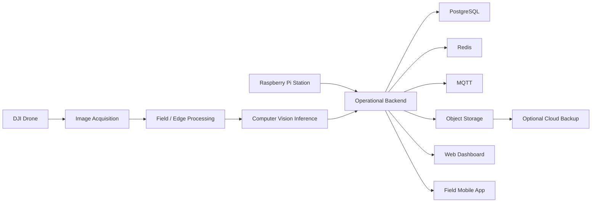

# AgroLens

> **Public project showcase.** The source code remains private while this repository documents the product, architecture and engineering scope.

## Overview

**AgroLens** is an AgroTech platform for crop monitoring and disease-detection workflows using **drones, computer vision, edge processing and cloud-connected applications**.

The system is designed around field operation: image acquisition, local/edge inference, model experimentation, operational APIs, dashboards and mobile tooling.

## Recognition

- **2nd Place — Hult Prize PUCP**
- **2nd Place — START Latam**

## Problem

Agricultural monitoring often depends on manual inspection and fragmented field data. AgroLens explores a workflow where aerial imagery and computer vision can support faster detection, traceability and agricultural decision-making.

## Solution

The private implementation is organized as a modular platform that includes:

- DJI drone acquisition workflows
- Computer-vision inference
- Crop/model training workspace
- Operational backend
- Web dashboard
- Mobile field application
- Android pilot application
- Raspberry Pi field station
- Optional cloud storage for evidence and backups

## Architecture

## Technology

| Area | Technologies |
|---|---|
| Backend | NestJS · Prisma |
| Data | PostgreSQL · Redis |
| AI / Vision | Python · Computer Vision · Model Training |
| Web | React · Vite |
| Mobile | Expo · React Native |
| Drone | Kotlin · DJI MSDK |
| Edge | Raspberry Pi · Python |
| Messaging | MQTT |
| Infrastructure | Docker · MinIO |
| Cloud | AWS S3 |

## Engineering Highlights

- Edge-oriented processing for field environments
- Separation between model training and operational inference
- Shared backend serving dashboard and field applications
- Raspberry Pi integration for independent field-station workflows
- Dockerized development infrastructure
- Cloud storage treated as an extension rather than a hard runtime dependency
- Explicit testing and backlog documentation instead of presenting unfinished work as production-ready

## Project Status

The platform has an implemented technical foundation and working development flows, while hardware validation, production security and real-world datasets remain part of the broader validation roadmap.

## Repository Strategy

The private repository contains implementation code, environment contracts, infrastructure definitions and technical experiments. This public repository intentionally exposes only portfolio-safe architecture and product information.

## More Documentation

[Architecture notes](./docs/ARCHITECTURE.md)

---

**Private source repository · Public AgroTech case study**
