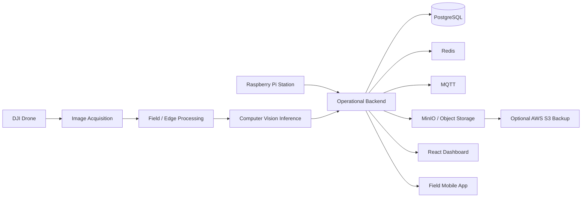

# AgroLens

### Drones · Computer Vision · Edge AI · Agriculture

**Public engineering showcase — source code remains private**

[Architecture](./docs/ARCHITECTURE.md) · [Project status](./docs/STATUS.md)

---

## Overview

**AgroLens** is an AgroTech platform for crop monitoring and disease-detection workflows using drones, computer vision, edge processing and field applications.

The private project is organized as a multi-application system: DJI-assisted acquisition, local inference, model-training workspaces, an operational backend, a dashboard, a mobile field app and a Raspberry Pi station.

## Recognition

- **2nd Place — Hult Prize PUCP**
- **2nd Place — START Latam**

## Problem

Agricultural inspection is often manual, intermittent and difficult to scale. AgroLens explores a workflow where aerial imagery and local AI can turn field observations into structured evidence and operational information.

## System Design

## Private Repository Structure

The private monorepo contains separate projects for:

- NestJS/Prisma backend
- field agent
- visual inference engine
- crop/model training
- React/Vite dashboard
- Expo/React Native field app
- Kotlin + DJI MSDK pilot app
- Raspberry Pi station
- public landing page

This separation keeps training, inference, field hardware and product applications from collapsing into a single tightly coupled codebase.

## Technology

| Area | Technologies |
|---|---|
| Backend | NestJS · Prisma |
| Data | PostgreSQL · Redis |
| AI / Vision | Python · Computer Vision · model training |
| Web | React · Vite |
| Mobile | Expo · React Native |
| Drone | Kotlin · DJI MSDK |
| Edge | Raspberry Pi · Python |
| Messaging | MQTT |
| Infrastructure | Docker · MinIO |
| Cloud | AWS S3 integration path |

## Engineering Decisions

**Edge-first operation.** The architecture does not require every field action to depend on a remote cloud service.

**Training and inference are separated.** Model experimentation can evolve without turning the production inference path into a research notebook.

**Cloud storage is optional for heavy evidence/backups.** The local platform remains the primary operational core.

**Status is explicit.** The private README states that the base compiles and core mocks work, while hardware, real datasets and production security still require further validation.

## Current Status

The software foundation and principal mocked development flows are implemented. The project is **not presented as production-certified**. Hardware validation, real datasets/models and production-grade security remain part of the roadmap.

[See the explicit status matrix →](./docs/STATUS.md)

## Why the Source Is Private

The implementation repository contains infrastructure, environment contracts, model workspaces and product code that are not appropriate for a public portfolio.

---

### What this project demonstrates

**Computer vision · edge/cloud architecture · drones · mobile/web systems · backend design · field-oriented engineering**
