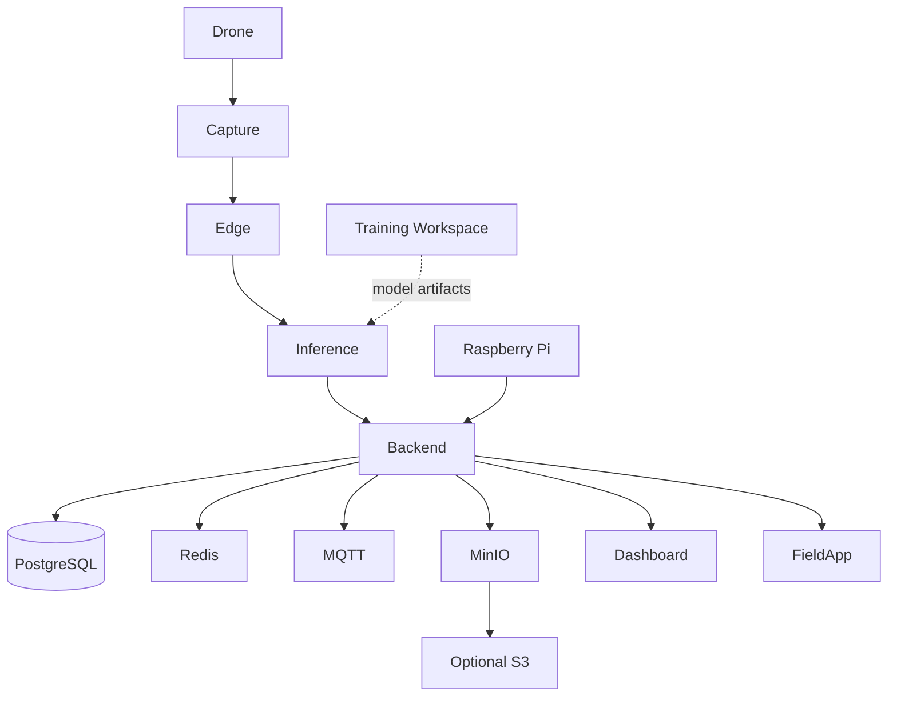

# AgroLens — Architecture

## 1. Architectural Goal

AgroLens is designed around field constraints: data acquisition may happen away from reliable connectivity, imagery is heavy, AI inference has different requirements from model training, and users need both technical and operational interfaces.

## 2. Functional Layers

### Acquisition

DJI-oriented acquisition workflows capture field imagery.

### Edge / field processing

Field components prepare data for inference and can operate independently of a permanent cloud connection.

### AI inference

The inference runtime is separated from the crop/model training workspace.

### Platform backend

The operational backend provides API and data services to multiple clients.

### Clients

- web dashboard
- mobile field application
- technical Android/DJI pilot
- Raspberry Pi station

## 3. Diagram

## 4. Design Principles

- Keep inference separate from training.
- Prefer local/edge continuity when connectivity is weak.
- Centralize contracts through the backend rather than coupling clients directly to storage.
- Treat large image evidence differently from transactional data.
- Keep hardware validation separate from software completeness claims.

## 5. Development Infrastructure

The private repository uses Docker-based local infrastructure and separates development/production compose overlays. Production-oriented configuration requires real secrets and hardened settings; development placeholders are not treated as deployable production configuration.
