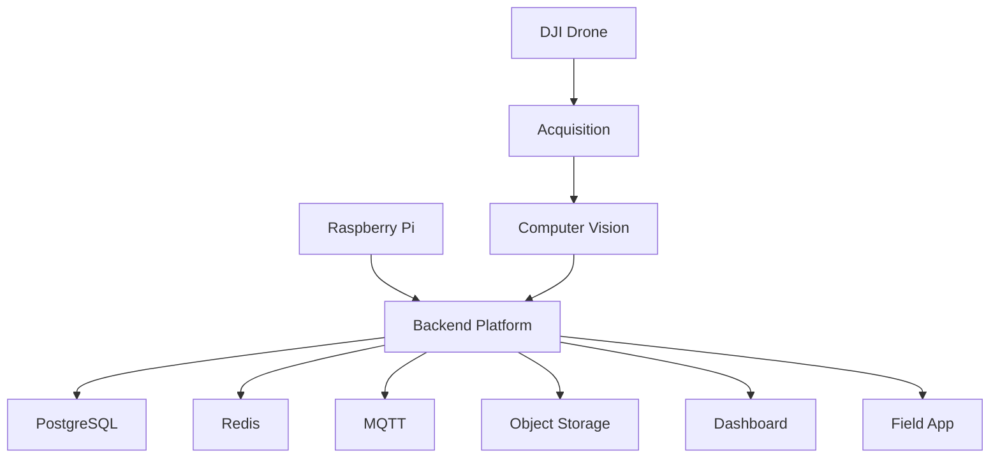

# AgroLens — Architecture Notes

## System Boundaries

AgroLens is organized around four technical zones:

1. **Acquisition** — drone and field data.
2. **Edge / AI** — inference and local processing.
3. **Platform** — backend, database and messaging.
4. **Clients** — dashboard and field applications.

## Logical Flow

## Design Considerations

- Field operation should not depend entirely on remote cloud services.
- Model training is separated from production inference.
- Backend contracts support multiple client applications.
- Heavy media/evidence can be stored outside the core transactional path.
- Hardware and real-dataset validation are tracked separately from software completeness.
